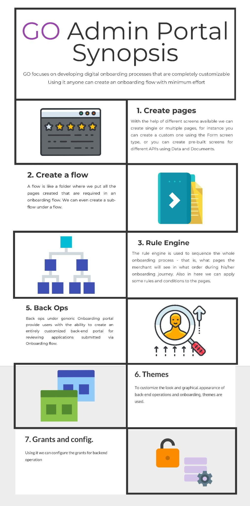

# Overview

### How to use this documentation 

This documentation contains all the details that are required to maintain, support and execute the IndusInd Current Account Opening Product created by Signzy.

#### Audience

**Bank**\
&#x20;**IT Personnel -** This documentation is intended to be used by the Bank personnel at IndusInd (IT/Product) teams. Document gives an overview of the structure and design of the Product.\
**Bank Training personnel -** Bank's team can use the FAQ and installation+mobile app sections of the document as a help document for the purpose of training the on-ground staff and their sales forces.

**Signzy Personnel -** Also to be used by Signzy maintenance personnel (Tech support & Developers) to avail the idea of the infrastructure and how to conduct the maintenance + scaling for product.

### Structure of this documentation

The documentation is broadly divided into following sections and contains relevant details for each.

1. Infrastructure details
   1. Contains information regarding the servers, devices and other important infrastructure on which the product is running.
   2. Also contains information on how to maintain the infrastructure & revamp when incidents occur.
2. Maintenance manual
   1. The maintenance manual is intended for the database and system admins who make sure the infrastructure and the services are up and running & servicing the client needs.
3. Support&#x20;
   1. Support personnel
      1. Contains important and comprehensive information that will help the support personnel deployed for the product in providing better customer support to the Relationship managers and the end customers
   2. Service desk staff
      1. FAQs & product information to enhance the adoption and faster query resolution.
4. Master APIs
   1. The master APIs that the product uses for customisation of the front-end choice factors and information sources

