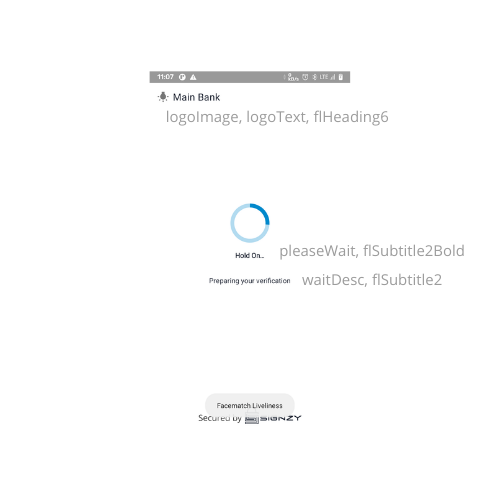
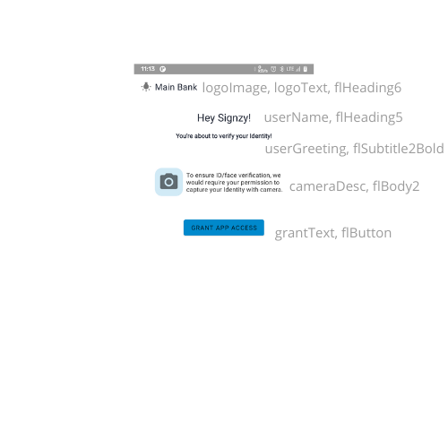
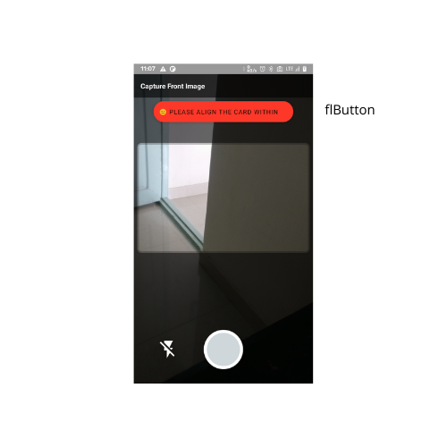
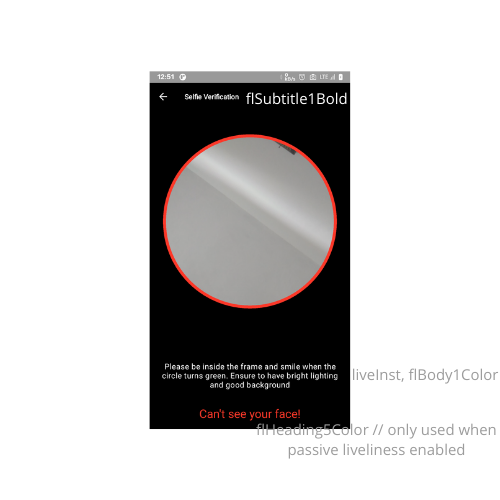
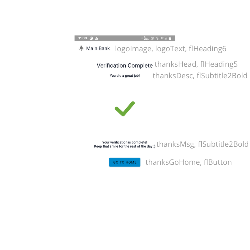

# Facematch-Liveness Integration

## Requirements

### Developer Requirements

The following tools should be installed:

* [**Android Studio**](https://developer.android.com/studio/)****
* ****[**JDK**](http://www.oracle.com/technetwork/java/javase/downloads/index.html)****


Minimum API Level required is 21 (Android 5.0 and above)


### Device Requirements

Device with both Front and Back Cameras.

## Setup

Step 1: Add the following code in **app level build.gradle file:**

The SDK is purely written in Kotlin, so if your app is written in Java then you need to make the following changes.


Also enable data binding.



```
plugins {
    ...
    
    id 'kotlin-kapt'
}

android {

    //...
    //...
    
    compileOptions {
        sourceCompatibility JavaVersion.VERSION_1_8
        targetCompatibility JavaVersion.VERSION_1_8
    }
    dataBinding {
        enabled = true
    }
}
dependencies {
    //...
    implementation 'org.jetbrains.kotlin:kotlin-stdlib:latest-version'
    implementation 'androidx.core:core-ktx:latest-version'
    implementation 'androidx.appcompat:appcompat:latest-version'
    implementation 'androidx.constraintlayout:constraintlayout:latest-version'

}
```


### Adding SDK to Project

A zip file is provided, extract it and place it in the **app/libs** directory of your project.&#x20;

> **app** is the root app module of your project

Add the following to **build.gradle** file



```groovy
dependencies { 
    ...
    
    implementation("com.signzy.ai:facematch-liveliness:1.0.0") {
        transitive = true
    }
        
    ...
}
```



```groovy
buildscript {
    repositories {
        google()
        
        ...
        
        maven {
            // path to the folder in libs directory you added above
            url "${rootProject.projectDir}/app/libs/facematch-liveliness-release"
        }
        
        maven { url "https://developer.huawei.com/repo/" }
        
        maven { url "https://www.jitpack.io" }
        
        ...
    }
}
    
allprojects {
    repositories {
        google()
        
        ...
        
        maven {
            // path to the folder in libs directory you added above
            url "${rootProject.projectDir}/app/libs/facematch-liveliness-release"
        }
        
        maven { url "https://developer.huawei.com/repo/" }
        
        maven { url "https://www.jitpack.io" }
        
        ...
    }
}

```



### Starting SDK

To open SDK you have to invoke an intent for the activity: **FaceMatchLivelinessActivity**

Create a intent launcher by the following code&#x20;





```kotlin
private val intentLauncher = registerForActivityResult(
            ActivityResultContracts.StartActivityForResult()
) { result ->
            
}
```



```java
ActivityResultLauncher<Intent> intentLauncher = registerForActivityResult(new StartActivityForResult(),
        new ActivityResultCallback<ActivityResult>() {
    @Override
    public void onActivityResult(ActivityResult result) {
        
    }
});
```



Now define an intent as:



```kotlin
...

val intent = Intent(requireContext(), FLActivity::class.java)
intentLauncher.launch(intent)

...
```



```
...

Intent intent = new Intent(this, FaceMatchLivelinessActivity.class);
intentLauncher.launch(intent);

...
```



The results are returned in **intentLauncher** defined above:

Results can be obtained by checking following result codes:



```kotlin
...

if (result.resultCode == RESULT_FML) {
    val resultData =
        result.data?.getParcelableExtra<DetectionData>("result")

    if (resultData != null) {
        // Save or use the result
    }
}
...
```



```java
...

if (result.resultCode == RESULT_FML) {
    Parcelable<DetectionData> resultData =
        result.getData().getParcelableExtra<DetectionData>("result")

    if (resultData != null) {
        // Save or use the result
    }
}
...
```



### **Results**

Results returned is of type **DetectionData,** which has the following data in it:

* **Id Card Data:**
  * This contains 3 information
    * Front Side of Card
    * Backside of Card(Optional)
    * Face Detected from Front Side of Card
* **First Verification (Optional)**
  * This is returned only when passive liveliness is enabled.
  * &#x20;This will contain:
    * Face Detected (Image)
    * Face Match Score (Double value)
    * Face Match (True/False)
* **Second Verification (Optional)**
  * This is returned only when liveliness is detected.
  * This will contain:
    * Face Detected (Image)
    * Face Match Score (Double value)
    * Face Match (True/False)
* **Active Liveliness**
  * This will return the 2 values
    * Liveliness Score (Double value)
    * Liveliness (True/False)
* **Passive Liveliness (Optional)**
  * This will be returned only when passive liveliness is enabled.
  * This will return the 2 values
    * Liveliness Score (Double value)
    * Liveliness (True/False)

The signature for **DetectionData** class is as follows:

```
DetectionData(
    var idCardData: ICardData,
    var firstVerification: FaceData,
    var secondVerification: FaceData,
    var passiveLiveliness: Boolean,
    var passiveLivelinessScore: Double,
    var activeLiveliness: Boolean,
    var activeLivelinessScore: Double,
)

ICardData(
    var frontImage: String,
    var backImage: String,
    var faceImage: String,
)

FaceData(
    val faceImage: String,
    val faceMatchScore: Double,
    val faceMatch: Boolean
)
```

### Customization

Various parts of UI can be custoized based in the requirement matching the parent app

The following section defines the UI customization parameters.

The customization parameters can be passed with the intent that is invoking the activity, to do so add a intent extra value with name **flparams** and pass **FLParams** as the value



```kotlin
...

intent.putExtra(
    "flparams",
    FLParams( )
)

...
```



```java
...

intent.putExtra(
    "flparams",
    FLParams( )
)

...
```



Signature for **FLParams** class is as follows: (**All the parameters are optional**)

All the parameters and their positions are explained in the images below:

```
FLParams(
    // Global app background color
    val appBackground: Int,

    // Appbar customization params
    val logoImage: Int,
    val logoText: Int,

    // Landing Fragment Text
    val pleaseWait: Int,
    val waitDesc: Int,

    // Permissions Fragment Text
    val userName: String,
    val userGreeting: Int,
    val cameraDesc: Int,
    val locationDesc: Int,
    val grantText: Int,

    // Submit Identity Fragment Text
    val submitId: Int,
    val submitDesc: Int,
    val imageHolder: Int,
    val submitProof: Int,

    // Liveliness Instructions Fragment Text
    val livelinessHead: Int,
    val livelinessDesc: Int,
    val selfieDesc: Int,
    val smileyDesc: Int,
    val readyLiveliness: Int,

    // Liveliness Verification Fragment Text
    val liveInst: Int,

    // Thanks Fragment Text
    val thanksHead: Int,
    val thanksDesc: Int,
    val thanksMsg: Int,
    val thanksGoHome: Int,

    // Style Params
    val flHeading5: Int,
    val flHeading5Color: Int,
    val flHeading6: Int,
    val flHeading6Color: Int,
    val flSubtitle1Color: Int,
    val flSubtitle1Bold: Int,
    val flSubtitle2: Int,
    val flSubtitle2Bold: Int,
    val flBody1: Int,
    val flBody1Color: Int,
    val flBody2: Int,
    val flButton: Int,

    val skipLivelinessInstructions: Boolean,
    val passiveLivelinessRequired: Boolean,
)
```







 (1).png>)





