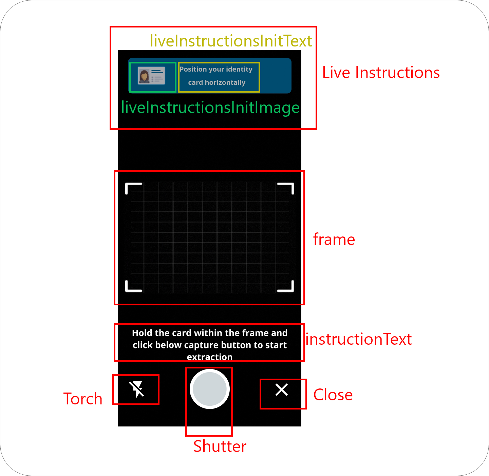

# Customizations

Various parts of UI can be customized based in the requirement matching the parent app&#x20;

The following section defines the UI customization parameters.&#x20;

The customization parameters can be passed with the intent that is invoking the activity, to do so add a intent extra value with name _**EXT\_UI\_PARAMS**_ and pass **IdCardExtractionUI** as the value.



```kotlin

intent.putExtra(
    IdCardExtractionActivity.EXT_UI_PARAMS,
    IdCardExtractionUI()
)
```



```java
intent.putExtra(
    IdCardExtractionActivity.EXT_UI_PARAMS,
    new IdCardExtractionUI()
)
```




All the parameters are Optional of IdCardExtractionUI class


Signature for IdCardExtractionUI class is as follows:

All the parameters and their positions are explained in the images below:

```java

public class IdCardExtractionUI {

    // Global app background color
    private int appBackground = R.color.white;

    // Global app status bar color
    private int statusBarColor = R.color.blue_500;

    // Appbar customization params
    private int appbarIcon = 0;
    private int appbarLabel = 0;
    private int appbarLabelStyle = R.style.DocReaderHeading6;
    private int appbarColor = 0;

    // Landing Fragment Text
    private int loadingDialogTitle = R.string.dr_wait_text;
    private int loadingDialogMsg = 0;
    private int loadingDialogBackground = R.drawable.doc_reader_rounded_corners;
    private int loadingDialogCancelText = R.string.dr_cancel;
    private int loadingDialogCancelStyle = 0;

    // Permissions Fragment Text
    private int userName = R.string.dr_hey_user;
    private int userNameStyle = R.style.DocReaderHeading5;
    private int userGreeting = R.string.dr_user_greeting;
    private int userGreetingStyle = R.style.DocReaderSubtitle2Bold;
    private int cameraDesc = R.string.dr_camera_description;
    private int cameraDescStyle = R.style.DocReaderBody2;
    private int cameraIcon = R.drawable.baseline_camera_alt_24;
    private int grantButtonText = R.string.dr_grant_access;
    private int grantButtonStyle = R.style.DocReaderButton;

    // Pre-Scanner
    private int wait = R.string.dr_wait_text;
    private int waitStyle = R.style.DocReaderSubtitle2Bold;


    // Scanner
    private boolean showTorchButton = true;
    private boolean showCloseButton = true;
    private boolean showInstructions = true;
    private boolean showLiveInstructions = true;

    private int torchOnIcon = R.drawable.ic_flash_on;
    private int torchOffIcon = R.drawable.ic_flash_off;
    private int closeIcon = R.drawable.ic_close;
    private int shutterIcon = R.drawable.ic_shutter;
    private int instructionText = R.string.hold_card_until_extraction;
    private int instructionTextStyle = 0;
    private int scannerFrame = R.drawable.card_scan_template;
    private int turnIdCardImage = R.drawable.turn_id_card;
    private int liveInstructionInitImage = R.drawable.id_card_template;
    private int liveInstructionInitText = R.string.position_card_information;
    private int liveInstructionInitTextStyle = 0;
    private int liveInstructionInitBackground = R.drawable.overlay_box; // 0 for remove background
    private int liveInstructionInitBackgroundSuccess = R.drawable.overlay_box;
    private int liveInstructionInitBackgroundWarn = R.drawable.overlay_box_red;
    private int informationOverlayTextStyle = 0;
    private int informationOverlayDetectText = R.string.detected;
    private int informationOverlayDetectBelowText = R.string.hold_steady_info;
    private int informationOverlayFlipText = R.string.flip_the_card;
    private int informationOverlayScanBackText = R.string.scan_back;
    private int extractedDataKeyStyle = 0;
    private int extractedDataValueStyle = 0;
}
```


| Parameter                                 | Type                               | Description                                                                                                                                                                                                                                    |
| ----------------------------------------- | ---------------------------------- | ---------------------------------------------------------------------------------------------------------------------------------------------------------------------------------------------------------------------------------------------- |
| **appBackground**                         | Int (Resource Color)               | Global app background color                                                                                                                                                                                                                    |
| **statusBarColor**                        | Int (Resource Color)               | Changes status bar color of sdk screens                                                                                                                                                                                                        |
| **theme**                                 | Int (Resource Style)               | Targets the theme of the SDK. Be aware while using it, you may also require to change the **appBackground**, and styles of various other components mentioned below.                                                                           |
| **logoImage**                             | Int (Resource Drawable)            | Logo image displayed on action bar                                                                                                                                                                                                             |
| **logoText**                              | Int (Resource String)              | Title displayed on action bar                                                                                                                                                                                                                  |
| **logoTextStyle**                         | Int (Resource Style)               | Styling for title of action bar. (configure most of the things which works with textViews)                                                                                                                                                     |
| **loadingDialogTitle**                    | Int (Resource String)              | title for loading dialog shown on landing screen                                                                                                                                                                                               |
| **loadingDialogMsg**                      | Int (Resource String)              | description mesaage for loading dialog. By default it is 0 and SDK is setted such way that for O value it should not show **loadingDialogMsg**.                                                                                                |
| **loadingDialogBackground**               | Int (Resource Drawable)            | Background of loading dialog shown on landing screen                                                                                                                                                                                           |
| **loadingDialogCancelText**               | Int (Rosource String)              | Cancel button text for loading dialog                                                                                                                                                                                                          |
| **loadingDialogCancelStyle**              | Int (Resource Style)               | Styling cancel button shown on loading dialog (configure most of the things which works with Buttons). By default it is 0 and SDK is setted such way that for O value it should not set any custom styling to cancel button of loading dialog. |
| **userName**                              | Int (Resource String)              | Text displayed on Permission Screen. For more better understanding refer to below images                                                                                                                                                       |
| **userNameStyle**                         | Int (Resource Style)               | Styling for title of **userName**. (configure most of the things which works with textViews)                                                                                                                                                   |
| **userGreeting**                          | Int (Resource String)              | Text displayed on Permission Screen below **userName**. For more better understanding refer to below images                                                                                                                                    |
| **userGreetingStyle**                     | Int (Resource Style)               | Styling of **userGreeting**. (configure most of the things which works with textViews)                                                                                                                                                         |
| **cameraDesc**                            | Int (Resource String)              | Description message which is being displayed for asking camera permission. For more better understanding refer to below images                                                                                                                 |
| **cameraDescStyle**                       | Int (Resource Style)               | Styling of **cameraDesc** text. (configure most of the things which works with textViews)                                                                                                                                                      |
| **grantButtonText**                       | Int (Resource String)              | Below **cameraDesc** text **grantButton** present, when pressed to it tries to ask camera permission. To change its text pass this parameter.                                                                                                  |
| **grantButtonStyle**                      | Int (Resource Style)               | Styling of **grantButton**.(configure most of the things which works with Buttons)                                                                                                                                                             |
| **wait**                                  | Int (Resource String)              | Before Scanner Start a blank screen Appears with this text aligned center                                                                                                                                                                      |
| **waitStyle**                             | Int (Resource Style)               | Styling of **wait** text.                                                                                                                                                                                                                      |
| **showTorchButton**                       | Boolean                            | Should show torch button or not on scanner                                                                                                                                                                                                     |
| **showCloseButton**                       | Boolean                            | Should show close button or not on scanner                                                                                                                                                                                                     |
| **showIntructions**                       | Boolean                            | Should show instructions or not on scanner (check below images for better understanding)                                                                                                                                                       |
| **showLiveInstructions**                  | Boolean                            | Should show live instructions or not on scanner (check below images for better understanding)                                                                                                                                                  |
| **torchOnIcon**                           | Int (Resource Drawable)            | changes torch on icon                                                                                                                                                                                                                          |
| **torchOffIcon**                          | Int (Resource Drawable)            | changes torch off icon                                                                                                                                                                                                                         |
| **closeIcon**                             | Int (Resource Drawable)            | changes close button drawable                                                                                                                                                                                                                  |
| **shutterIcon**                           | Int (Resource Drawable)            | changes shutter button drawable                                                                                                                                                                                                                |
| **instructionText**                       | Int (Resource String)              | Targets instruction text on scanner (Check below images for better understanding)                                                                                                                                                              |
| **instructionTextStyle**                  | Int (Resource Style)               | Changes style of instruction text. 0 to use default one.                                                                                                                                                                                       |
| **scannerFrame**                          | Int (Resource Drawable)            | Targets Frame outline inside which card is aligned                                                                                                                                                                                             |
| **turnIdCardImage**                       | Int (Resource Drawable)            | If front and back both has to be caputured for an id card to a rotating image is show. this targets that rotating image                                                                                                                        |
| **liveInstructionsInitImage**             | Int (Resource Drawable)            | targets live instructions image (Check below images for better understanding)                                                                                                                                                                  |
| **liveInstructionsInitText**              | Int (Resource String)              | targets live instructions text (Check below images for better understanding)                                                                                                                                                                   |
| **liveInstructionsInitTextStyle**         | <p>Int </p><p>(Resource Style)</p> | changes style of **liveInstructionsInitText**. 0 for default styling                                                                                                                                                                           |
| **liveInstructionsInitBackground**        | Int (Resource Drawable, Color)     | Initail background of live intructions. 0 to remove it                                                                                                                                                                                         |
| **liveInstructionsInitBackgroundSuccess** | Int (Resource Drawable, color)     | Success (When SDK identifies card) background of live instructions. 0 to remove it                                                                                                                                                             |
| **liveInstructionsInitBackgroundWarn**    | Int (Resource Drawable, Color)     | Warn (When SDK unable to identify card) background of live instructions. 0 to remove it                                                                                                                                                        |
| **informationOverleyDetectText**          | Int (Resource String)              | when Card is detected so message is show with detected card name.                                                                                                                                                                              |
| **informationOverleyDetectBelowText**     | Int (Resource String)              | A instruction message showed below detected message                                                                                                                                                                                            |
| **informationOverleyFlipText**            | Int (Resource String)              | Card flip instruction                                                                                                                                                                                                                          |
| **informationOverleyScanBackText**        | Int (Resource String)              | Scan back instruction                                                                                                                                                                                                                          |
| **informationOverleyTextStyle**           | Int (Resource Style)               | Style of overley texts show for live instructions (includes **informationOverleyDetectText**, **informationOverleyDetectBelowText**, **informationOverleyFlipText**, **informationOverleyScanBackText**)                                       |
| **extractedDataKeyStyle**                 | Int (Resource Style)               | When extractions start so extracted key is appeared, it target its style. 0 for default style                                                                                                                                                  |
| **extractedDataValueStyle**               | Int (Resource Style)               | When extractions so extracted value is appeared, it target its style. 0 for default style                                                                                                                                                      |




.png>)

.png>)

.png>)
