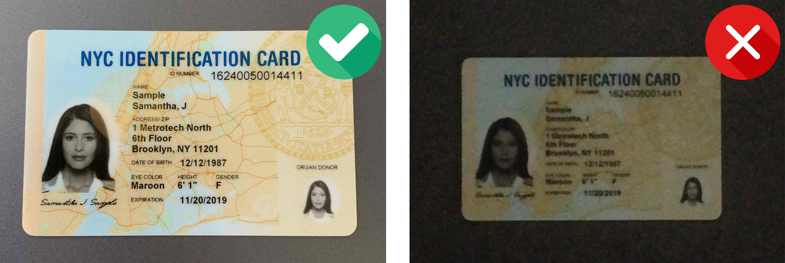
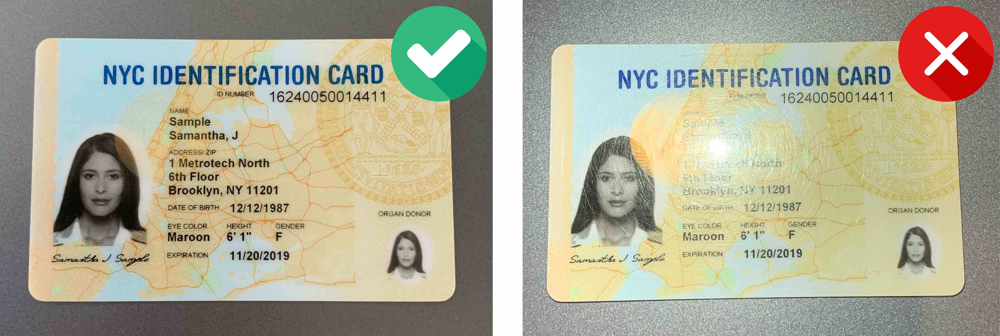
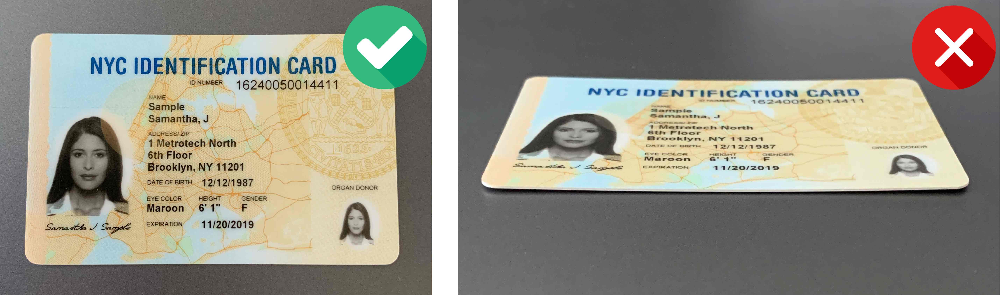
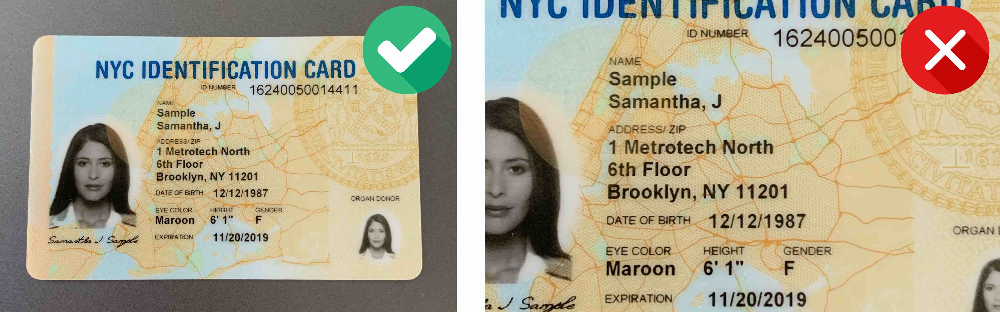
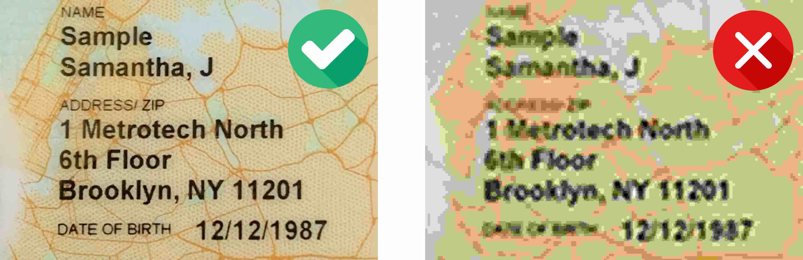
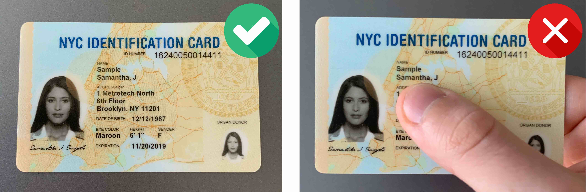

# Image quality requirements


The developed intelligent system is not able to overcome the laws of physics and works exclusively within its capabilities.


Below are the requirements for the size and quality of document images captured by any device, which are necessary for successful image processing by Document Reader SDK:

#### **Good lighting** 

Good lighting helps to achieve better OCR results. If the image is too dark or too bright, the document might not be processed successfully

#### **Avoid reflections** 

Glares and reflections interfere with processing and reduce data extraction accuracy. We recommend **not to use** the flash of your mobile device when capturing document images.

#### **Focus and sharpness** 

Make sure the image is clear and there are no blurred areas.

#### **Angle** 

The tilt angle of the document should not exceed 10 degrees in any direction (horizontal or vertical).

#### **Margins (too small)** 

Make sure there is minimal space around the document. It is recommended that the document takes up 70-80% of the image.

#### **Margins (too big)** 

Make sure the space around the document does not take up more than 20-30% of the image. It is recommended that the document takes up 70-80% of the image.

#### **Contrast** 

The document should be in clear contrast to the background. A light-colored document on a light background, as well as a dark-colored document on a dark background, might not be recognized.

#### **Resolution of the image** 

To achieve a good quality of recognition of identification documents, we recommend that you provide images captured by a camera with a resolution of at least Full HD (1920×1080) and autofocus.

#### **Extraneous objects** 

Make sure your hands or other objects do not cover document data.

