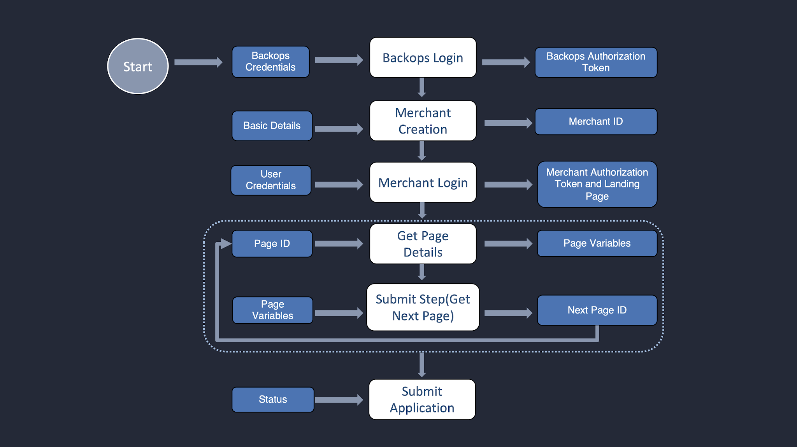

# Workflow

The entire process follows the below steps:

1. Backops User logs-in using **Backops login** API and gets authentication token and application id which is used further in the process.\

2. The Backops User creates a merchant using **Create merchant** API passing application id for the merchant, assigned business on-boarding flow and realm along with the basic details. After a merchant is created, the merchant login is enabled. Checkout the diagram above for better understanding. \

3. Merchant can login using **Merchant login** API. Upon logging in, the merchant receives details about the flow and application. From the same API they receive details about landing pages (page id) in the data.\

4.  Then the landing page which was received in the previous API request is queried to get the page

    details. The page details give all the required meta data information about the data fields

    which has to be collected from merchant for a particular step.\

5. On submitting the page, next page id is received and queried until the end of flow.
