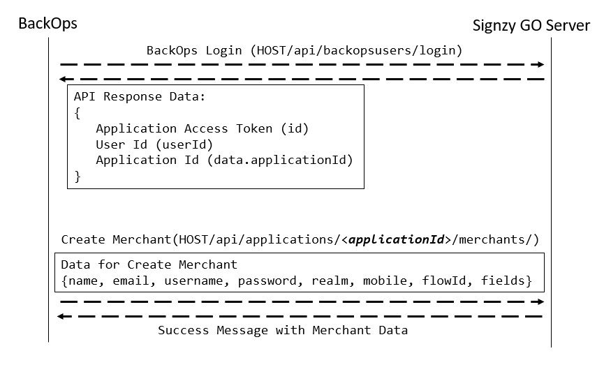

# Flow Diagram

## BackOps Login and Create Merchant

Backops User logs-in using **Backops login** API and gets authentication token and application id which is used later for sending consecutive requests.

To create a merchant the **Create merchant** API is called passing application id for the merchant, assigned business on-boarding flow and realm along with the basic details. After a merchant is created, the merchant login is enabled.

&#x20;

## Merchant Login and KYC Flow

.PNG>)

In order to complete the KYC, the Merchant has to login into the application using **Merchant login** API. Upon logging in, the merchant receives details about the flow and application. From the same API they receive details about landing pages (page id) in the data.

##

